# ProposalDetailsPage.js Implementation Analysis & Debug Guide

## Overview
This document provides a comprehensive analysis of the `ProposalDetailsPage.js` implementation, including timing issues, execution flow, and debugging strategies for nominee details automation failures.

## Table of Contents
1. [Architecture Overview](#architecture-overview)
2. [Execution Flow Analysis](#execution-flow-analysis)
3. [Timing & Wait Strategy Analysis](#timing--wait-strategy-analysis)
4. [Nominee Details Section Deep Dive](#nominee-details-section-deep-dive)
5. [Potential Issues & Debug Points](#potential-issues--debug-points)
6. [Mermaid Diagrams](#mermaid-diagrams)
7. [Debugging Recommendations](#debugging-recommendations)

## Architecture Overview

### Class Hierarchy
```
BaseRenewalPage (Base Class)
    ↓
ProposalDetailsPage (Inherits from BaseRenewalPage)
```

### Key Dependencies
- **BaseRenewalPage**: Provides common utilities (selectMuiOption, fillInput, setDateOnInput, etc.)
- **DatePickerCore**: Handles complex date picker interactions
- **Playwright Page Object**: Main browser interaction interface

### Main Entry Point
The `fillProposalDetailsForm(data)` method orchestrates the entire form filling process.

## Execution Flow Analysis

### Primary Flow Sequence
1. **Page Load Wait** (60s timeout)
2. **Personal Details Section** (Multiple fields with 2s timeouts)
3. **AA Membership Section** (Conditional, with visibility checks)
4. **NCB Carry Forward Section** (Complex vehicle/policy data)
5. **Policy Details Section** (Insurance company & office address)
6. **Nominee Details Section** (⚠️ **CRITICAL SECTION**)
7. **Payment Details Section** (Payment mode & DP selection)
8. **Proposal Preview Click** (Final submission)

### Data Flow
```
Test Data (proposalDetails.json) 
    ↓
RenewalFormSystem.executeWithCustomData()
    ↓
RenewalFormFlowCoordinator.executeProposalDetailsForm()
    ↓
ProposalDetailsPage.fillProposalDetailsForm()
    ↓
Individual Section Methods
```

## Timing & Wait Strategy Analysis

### Wait Strategies Used

#### 1. Page Load Waits
```javascript
// Primary page load wait (60s timeout)
await Promise.race([
  this.page.waitForSelector('input[name="DOB"]', { timeout: 60000 }),
  this.page.waitForSelector('text=/Proposal|Proposer|Checkout/i', { timeout: 60000 }),
  this.page.waitForSelector('input[name="FIRST_NAME"]', { timeout: 60000 })
]);
```

#### 2. Element Visibility Waits
```javascript
// Standard element visibility check (2s timeout)
if (await element.isVisible({ timeout: 2000 })) {
  // Perform action
}
```

#### 3. Dropdown Selection Waits
```javascript
// Material-UI dropdown wait (10s timeout)
await list.waitFor({ state: 'visible', timeout: 10000 });
```

#### 4. Navigation Waits
```javascript
// Post-click navigation wait (10s timeout)
await this.page.waitForLoadState('networkidle', { timeout: 10000 });
```

### Timing Issues Identified

1. **Inconsistent Timeout Values**: Mix of 2s, 10s, and 60s timeouts
2. **No Retry Logic**: Single attempt for critical operations
3. **Race Conditions**: Multiple selectors in Promise.race may cause timing issues
4. **Missing Wait States**: Some operations don't wait for DOM stability

## Nominee Details Section Deep Dive

### Implementation Analysis

```javascript
async fillNomineeDetailsSection(nomineeDetails) {
  console.log('🔍 [DEBUG] Starting fillNomineeDetailsSection...');
  console.log('🔍 [DEBUG] Nominee details data:', JSON.stringify(nomineeDetails, null, 2));
  
  try {
    // Nominee Name
    const nomineeNameInput = this.page.locator('input[name="NomineeName"]');
    if (await nomineeNameInput.isVisible({ timeout: 2000 })) {
      await this.fillInput(nomineeNameInput, nomineeDetails.nomineeName);
    }
    
    // Nominee Age
    const nomineeAgeInput = this.page.locator('input[name="NomineeAge"]');
    if (await nomineeAgeInput.isVisible({ timeout: 2000 })) {
      await this.fillInput(nomineeAgeInput, nomineeDetails.nomineeAge);
    }
    
    // Nominee Relation (Dropdown)
    await this.selectMuiOption('#mui-component-select-NomineeRelation', nomineeDetails.nomineeRelation);
    
    // Nominee Gender (Dropdown)
    await this.selectMuiOption('#mui-component-select-NomineeGender', nomineeDetails.nomineeGender);
    
  } catch (e) {
    console.log('Error filling Nominee Details section:', e.message);
  }
}
```

### Critical Issues Identified

#### 1. **Missing Error Handling for Dropdowns**
- `selectMuiOption` calls are not wrapped in try-catch blocks
- If dropdown selection fails, the entire section fails silently

#### 2. **Inconsistent Error Handling**
- Input fields have individual try-catch blocks
- Dropdown selections have no error handling
- This creates asymmetric error handling

#### 3. **No Validation of Data Completeness**
- No check if nomineeDetails object has all required fields
- No validation of field values before attempting to fill

#### 4. **Timing Dependencies**
- Dropdown selections depend on previous field completions
- No explicit waits between field operations
- Potential race conditions with form validation

## Potential Issues & Debug Points

### 1. **Data Flow Issues**
- **Issue**: `aaMembershipDetails` set to `null` in test data
- **Impact**: May affect form state and subsequent sections
- **Debug**: Check if null values cause form validation issues

### 2. **Page State Issues**
- **Issue**: Form may be in invalid state when nominee section loads
- **Impact**: Fields may be disabled or hidden
- **Debug**: Add page state validation before nominee section

### 3. **Element Locator Issues**
- **Issue**: Selectors may not match actual DOM structure
- **Impact**: Elements not found, causing silent failures
- **Debug**: Verify selectors match current page structure

### 4. **Timing Issues**
- **Issue**: Insufficient wait times for dynamic content
- **Impact**: Elements not ready when accessed
- **Debug**: Add explicit waits and retry logic

## Mermaid Diagrams

### Complete Execution Flow

```mermaid
graph TD
    A[Test Execution Starts] --> B[RenewalFormSystem.executeWithCustomData]
    B --> C[RenewalFormFlowCoordinator.executeFlowWithValidation]
    C --> D[Login & Navigation]
    D --> E[Policy Vehicle Form]
    E --> F[Additional Details Form]
    F --> G[Click BUY NOW]
    G --> H[ProposalDetailsPage.fillProposalDetailsForm]
    
    H --> I[waitForProposalPageToLoad<br/>⏱️ 60s timeout]
    I --> J[fillPersonalDetailsSection<br/>⏱️ 2s per field]
    J --> K{AA Membership Data?}
    K -->|Yes| L[fillAAMembershipSection<br/>⏱️ 1s visibility check]
    K -->|No| M[fillNCBCarryForwardSection<br/>⏱️ 2s per field]
    L --> M
    M --> N[fillPolicyDetailsSection<br/>⏱️ 2s per field]
    N --> O[fillNomineeDetailsSection<br/>⚠️ CRITICAL SECTION]
    O --> P[fillPaymentDetailsSection<br/>⏱️ 2s per field]
    P --> Q[clickProposalPreview<br/>⏱️ 5s wait + 10s navigation]
    Q --> R[Test Complete]
    
    style O fill:#ff9999
    style I fill:#ffcc99
    style Q fill:#ffcc99
```



### Nominee Details Section Flow

```mermaid
graph TD
    A[fillNomineeDetailsSection Starts] --> B[Log Debug Info]
    B --> C[Try: Nominee Name Input<br/>⏱️ 2s visibility check]
    C --> D{Name Input Visible?}
    D -->|Yes| E[fillInput - Name]
    D -->|No| F[Skip Name - Log Error]
    E --> G[Try: Nominee Age Input<br/>⏱️ 2s visibility check]
    F --> G
    G --> H{Age Input Visible?}
    H -->|Yes| I[fillInput - Age]
    H -->|No| J[Skip Age - Log Error]
    I --> K[Try: Nominee Relation Dropdown<br/>⚠️ NO ERROR HANDLING]
    J --> K
    K --> L[selectMuiOption - Relation<br/>⏱️ 10s dropdown wait]
    L --> M{Relation Selection Success?}
    M -->|Yes| N[Try: Nominee Gender Dropdown<br/>⚠️ NO ERROR HANDLING]
    M -->|No| O[❌ SILENT FAILURE]
    N --> P[selectMuiOption - Gender<br/>⏱️ 10s dropdown wait]
    P --> Q{Gender Selection Success?}
    Q -->|Yes| R[✅ Section Complete]
    Q -->|No| S[❌ SILENT FAILURE]
    O --> T[Continue to Next Section]
    S --> T
    R --> T
    
    style K fill:#ff9999
    style N fill:#ff9999
    style O fill:#ff6666
    style S fill:#ff6666
```



### Timing Analysis Diagram


### Error Handling Flow

```mermaid
graph TD
    A[Method Execution] --> B{Has Try-Catch?}
    B -->|Yes| C[Execute in Try Block]
    B -->|No| D[Execute Directly]
    C --> E{Operation Success?}
    D --> F{Operation Success?}
    E -->|Yes| G[Continue to Next]
    E -->|No| H[Log Error & Continue]
    F -->|Yes| G
    F -->|No| I[❌ Unhandled Exception]
    H --> G
    G --> J[Next Method]
    I --> K[❌ Test Failure]
    
    style I fill:#ff6666
    style K fill:#ff6666
    style H fill:#ffcc99
```



## Debugging Recommendations

### 1. **Immediate Fixes for Nominee Details**

#### Add Error Handling to Dropdowns
```javascript
// Nominee Relation
try {
  console.log('🔍 [NOMINEE] Attempting to fill Nominee Relation...');
  await this.selectMuiOption('#mui-component-select-NomineeRelation', nomineeDetails.nomineeRelation);
  console.log('✅ [NOMINEE] Nominee Relation filled successfully');
} catch (e) {
  console.log('❌ [NOMINEE] Error filling Nominee Relation:', e.message);
  // Add retry logic or alternative approach
}

// Nominee Gender
try {
  console.log('🔍 [NOMINEE] Attempting to fill Nominee Gender...');
  await this.selectMuiOption('#mui-component-select-NomineeGender', nomineeDetails.nomineeGender);
  console.log('✅ [NOMINEE] Nominee Gender filled successfully');
} catch (e) {
  console.log('❌ [NOMINEE] Error filling Nominee Gender:', e.message);
  // Add retry logic or alternative approach
}
```

#### Add Data Validation
```javascript
async fillNomineeDetailsSection(nomineeDetails) {
  console.log('🔍 [DEBUG] Starting fillNomineeDetailsSection...');
  
  // Validate required data
  if (!nomineeDetails || !nomineeDetails.nomineeName || !nomineeDetails.nomineeAge) {
    console.log('❌ [NOMINEE] Missing required nominee data');
    return;
  }
  
  console.log('🔍 [DEBUG] Nominee details data:', JSON.stringify(nomineeDetails, null, 2));
  // ... rest of implementation
}
```

#### Add Page State Validation
```javascript
async fillNomineeDetailsSection(nomineeDetails) {
  console.log('🔍 [DEBUG] Starting fillNomineeDetailsSection...');
  
  // Check if we're on the correct page
  const currentUrl = this.page.url();
  console.log(`🔍 [NOMINEE] Current URL: ${currentUrl}`);
  
  if (!currentUrl.includes('proposal') && !currentUrl.includes('checkout')) {
    console.log('⚠️ [NOMINEE] Warning: May not be on proposal details page');
  }
  
  // Wait for nominee section to be visible
  try {
    await this.page.waitForSelector('input[name="NomineeName"]', { timeout: 10000 });
    console.log('✅ [NOMINEE] Nominee section is visible');
  } catch (e) {
    console.log('❌ [NOMINEE] Nominee section not found:', e.message);
    return;
  }
  
  // ... rest of implementation
}
```

### 2. **Enhanced Debugging Strategy**

#### Add Comprehensive Logging
```javascript
async fillNomineeDetailsSection(nomineeDetails) {
  const startTime = Date.now();
  console.log('🔍 [NOMINEE] Starting fillNomineeDetailsSection...');
  console.log('🔍 [NOMINEE] Start time:', new Date().toISOString());
  
  try {
    // ... implementation with detailed logging
    
    const endTime = Date.now();
    const duration = endTime - startTime;
    console.log(`✅ [NOMINEE] Section completed in ${duration}ms`);
  } catch (e) {
    const endTime = Date.now();
    const duration = endTime - startTime;
    console.log(`❌ [NOMINEE] Section failed after ${duration}ms:`, e.message);
    throw e;
  }
}
```

#### Add Screenshot Capture
```javascript
async fillNomineeDetailsSection(nomineeDetails) {
  console.log('🔍 [NOMINEE] Starting fillNomineeDetailsSection...');
  
  // Take screenshot before starting
  await this.page.screenshot({ 
    path: 'debug-nominee-before.png',
    fullPage: true 
  });
  
  try {
    // ... implementation
    
    // Take screenshot after completion
    await this.page.screenshot({ 
      path: 'debug-nominee-after.png',
      fullPage: true 
    });
  } catch (e) {
    // Take screenshot on error
    await this.page.screenshot({ 
      path: 'debug-nominee-error.png',
      fullPage: true 
    });
    throw e;
  }
}
```

### 3. **Systematic Debugging Approach**

#### Step 1: Verify Test Data
- Check if `nomineeDetails` object is properly passed
- Validate all required fields are present
- Ensure data types match expected formats

#### Step 2: Verify Page State
- Confirm we're on the correct page
- Check if nominee section is visible
- Verify form is in editable state

#### Step 3: Verify Element Selectors
- Inspect DOM to confirm selectors are correct
- Check for dynamic IDs or classes
- Verify element visibility and enabled state

#### Step 4: Add Retry Logic
- Implement retry for failed operations
- Add exponential backoff for timing issues
- Add alternative approaches for dropdown selections

### 4. **Monitoring & Metrics**

#### Add Performance Monitoring
```javascript
// Track timing for each section
const sectionTimings = {
  personalDetails: 0,
  aaMembership: 0,
  ncbCarryForward: 0,
  policyDetails: 0,
  nomineeDetails: 0,
  paymentDetails: 0
};

// Log timing after each section
console.log('📊 Section Timings:', sectionTimings);
```

#### Add Success Rate Tracking
```javascript
// Track success/failure rates
const sectionResults = {
  personalDetails: 'success',
  aaMembership: 'skipped',
  ncbCarryForward: 'success',
  policyDetails: 'success',
  nomineeDetails: 'failed', // ⚠️ This is the issue
  paymentDetails: 'not_reached'
};
```

## Conclusion

The nominee details execution issue is likely caused by:

1. **Missing error handling** for dropdown selections
2. **Insufficient page state validation** before attempting to fill fields
3. **Timing issues** with dynamic form content
4. **Silent failures** that don't provide debugging information

The recommended fixes focus on:
- Adding comprehensive error handling
- Implementing proper validation
- Adding detailed logging and debugging
- Creating retry mechanisms for failed operations

This analysis provides a complete understanding of the ProposalDetailsPage implementation and actionable steps to resolve the nominee details execution issues.
